# Moonshot (SwiftUI)

Learn about the missions and astronauts that formed NASA’s Apollo space program.

## Resizing images to fit the screen using `GeometryReader`

| Original Size Image            | Clipped Image                  |
| ------------------------------ | ------------------------------ |
| 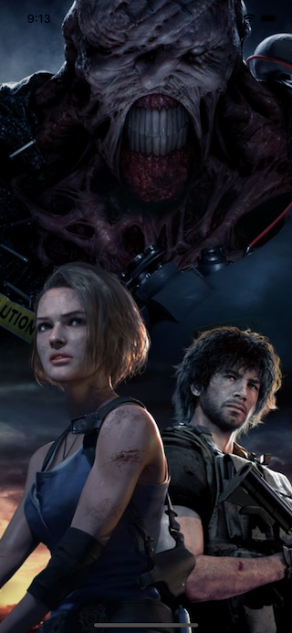 | 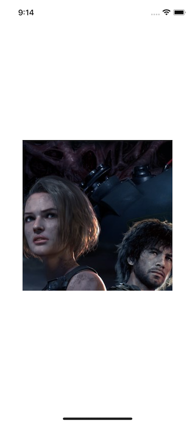 |

| Resizable image                | Image with Aspect Ratio (fit)  |
| ------------------------------ | ------------------------------ |
| 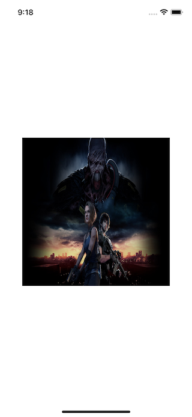 | 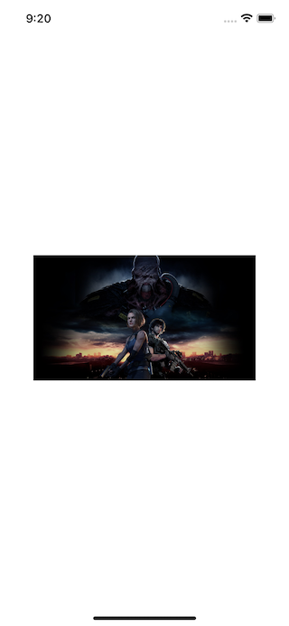 |

| Image with Aspect Ratio (fill) | Using Geometry Reader with fixed height |
| ------------------------------ | --------------------------------------- |
| 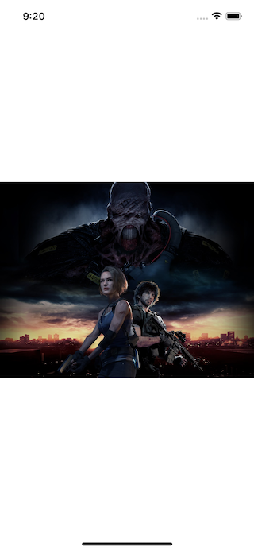 | 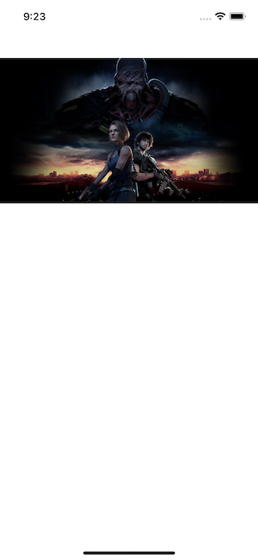          |

| Using Geometry Reader w/o fixed height |
| -------------------------------------- |
| 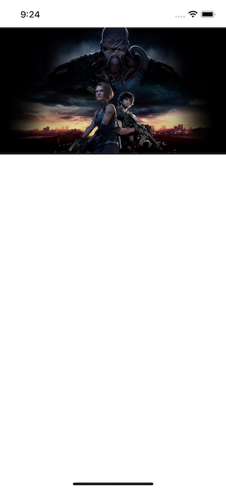         |

## How `ScrollView`s lets us work with scrolling data

| Basic ScrollView               | ScrollView with infinity width |
| ------------------------------ | ------------------------------ |
| 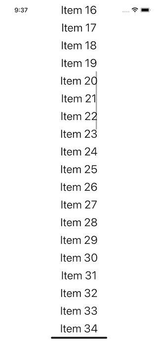 | 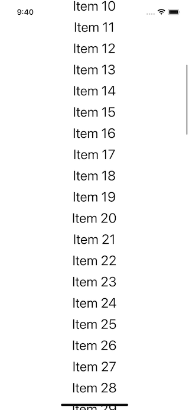 |

| List vs ScrollView (better performance) |
| --------------------------------------- |
| 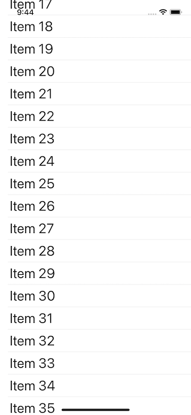          |

## Pushing new views onto the stack using `NavigationLink`

| Create a basic Text on View    | Use a NavigationLink to make Text tapable |
| ------------------------------ | ----------------------------------------- |
| 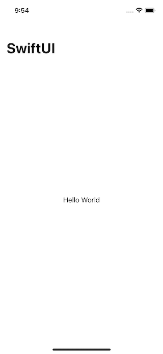 | 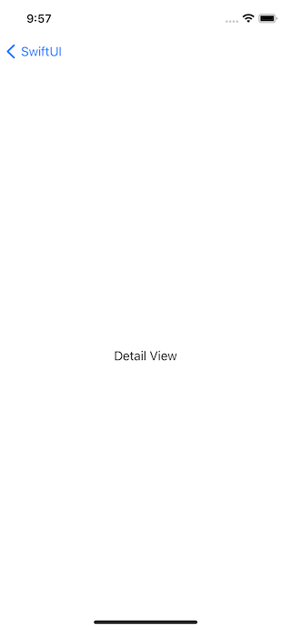            |

| Use NavigationLink on Lists    |
| ------------------------------ |
| 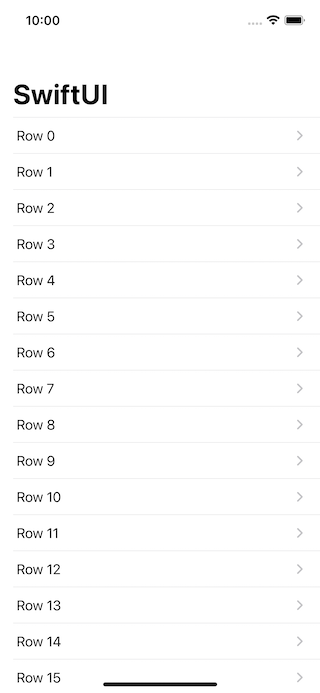 |

---

**MIT License**
